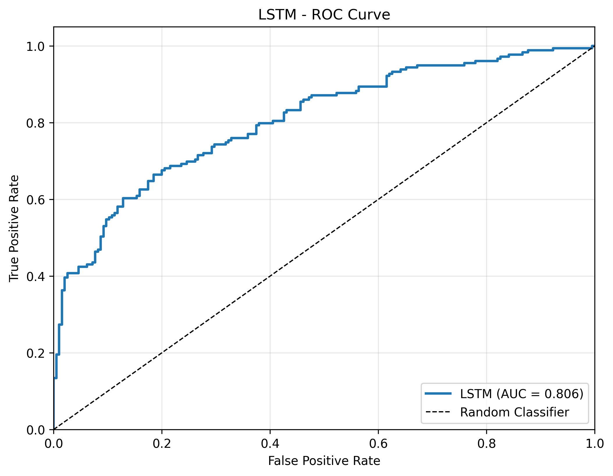
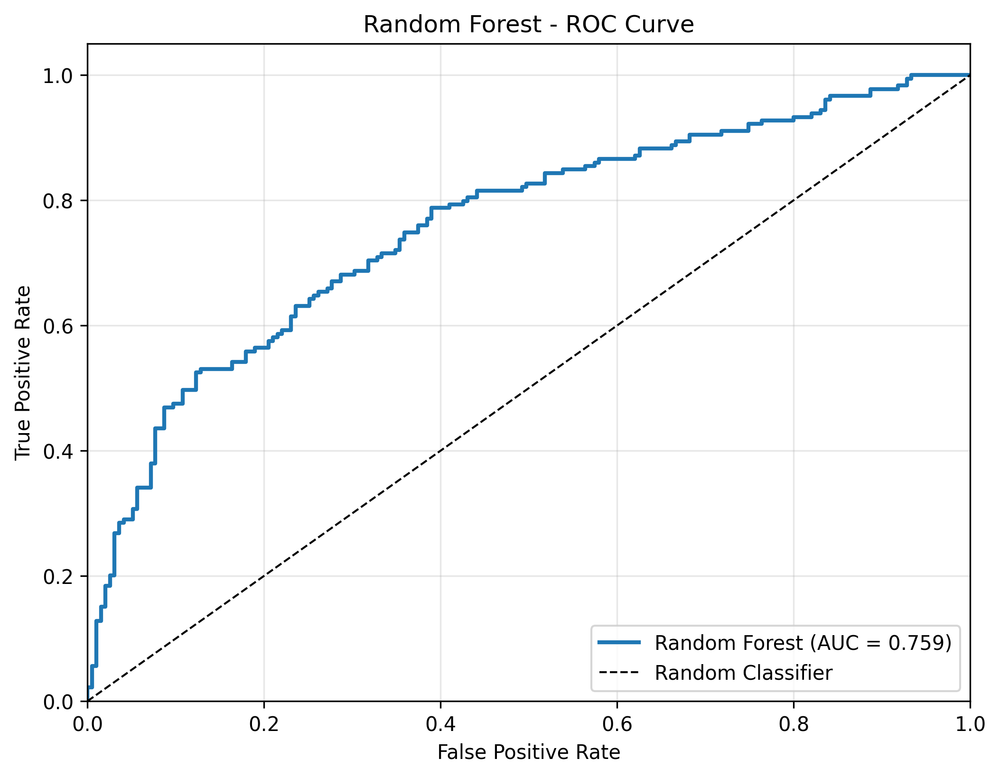

# PLSTM-TAL Stock Market Prediction

Implementation of "Enhanced prediction of stock markets using a novel deep learning model PLSTM-TAL" with complete technical indicators suite and comprehensive evaluation framework.

## Overview

This repository implements the complete PLSTM-TAL (Peephole LSTM with Temporal Attention Layer) pipeline for stock market trend prediction, as described in the research paper. The implementation includes all 40 technical indicators, EEMD denoising, contractive autoencoder, and comprehensive baseline comparisons.

### Key Features Implemented

#### 1. Complete Technical Indicators Suite
- **All 40 Indicators**: Bollinger Bands, WMA, EMA, DEMA, KAMA, MAMA, MIDPRICE, SAR, SMA, T3, TEMA, TRIMA, AD, ADOSC, OBV, MEDPRICE, TYPPRICE, WCLPRICE, ADX, ADXR, APO, AROON, AROONOSC, BOP, CCI, CMO, DX, MACD, MFI, MINUS_DI, MOM, PLUS_DI, LOG_RETURN, PPO, ROC, RSI, STOCH, STOCHRSI, ULTOSC, WILLR
- **Paper-Compliant Implementation**: All indicators computed using TA-Lib compatible methods
- **Robust Feature Engineering**: Proper handling of NaN values and normalization

#### 2. Data Pipeline
- **Real Market Data**: S&P 500 data from Yahoo Finance (2015-2025)
- **Data Validation**: Outlier detection and data quality checks
- **Synthetic Fallback**: Realistic synthetic data generation when needed

#### 3. EEMD Denoising
- **Ensemble Empirical Mode Decomposition**: Custom implementation with configurable parameters
- **Sample Entropy Calculation**: IMF complexity measurement for noise identification
- **Adaptive Noise Removal**: Removes highest entropy IMF for signal enhancement

#### 4. Contractive Autoencoder (CAE)
- **Feature Compression**: 46 indicators → 32 latent features
- **Contractive Loss**: L_CAE = MSE + λ||J_h(X)||_F^2
- **Jacobian Penalty**: Regularization for noise-invariant representations

#### 5. PLSTM-TAL Architecture
- **Peephole LSTM**: Enhanced LSTM with peephole connections
- **Temporal Attention Layer**: Attention mechanism for sequence modeling
- **Paper-Compliant Hyperparameters**: Units=64, Activation=tanh, Optimizer=Adamax

#### 6. Comprehensive Baseline Models
- **CNN**: Convolutional Neural Network with optimized architecture
- **LSTM**: Standard LSTM baseline
- **SVM**: Support Vector Machine with RBF kernel
- **Random Forest**: Ensemble tree-based method

#### 7. Evaluation Framework
- **Multiple Metrics**: Accuracy, Precision, Recall, F1-Score, AUC-ROC, PR-AUC, MCC
- **Visualization**: ROC curves, PR curves, confusion matrices
- **Model Comparison**: Comprehensive performance analysis

## Project Structure

```
xdj/
├── main.py                    # Main execution script
├── config.json               # Full configuration
├── config_fast.json          # Fast testing configuration
├── requirements.txt          # Python dependencies
├── instructions.txt          # Original paper instructions
├── src/                      # Source code modules
│   ├── io.py                 # Data loading and caching
│   ├── indicators.py         # 40+ technical indicators implementation
│   ├── eemd.py              # EEMD decomposition implementation
│   ├── cae.py               # Contractive Autoencoder
│   ├── model_plstm_tal.py   # PLSTM-TAL model implementation
│   ├── baselines.py         # Baseline model implementations
│   ├── train.py             # Training infrastructure
│   ├── eval.py              # Evaluation and metrics
│   └── data_loader.py       # Data preprocessing utilities
├── data/                     # Data directory
│   └── sp500_raw.csv        # Cached S&P 500 data
├── results/                  # Full pipeline results
│   ├── metrics.json         # Model performance metrics
│   ├── model_comparison.csv # Comparison table
│   ├── *.png               # Visualization plots
│   └── *.pth               # Saved model weights
└── results_fast/            # Fast configuration results
    ├── metrics.json         # Model performance metrics
    ├── model_comparison.csv # Comparison table
    ├── *.png               # Visualization plots
    └── *.pth               # Saved model weights
```

## Installation and Setup

### Prerequisites
- Python 3.10+
- CUDA (optional, for GPU acceleration)

### Install Dependencies

```bash
# Clone the repository
git clone https://github.com/ajaygm18/xdj.git
cd xdj

# Install Python dependencies
pip install -r requirements.txt
```

**Note**: TA-Lib requires the C library to be installed first:
- **macOS**: `brew install ta-lib`
- **Ubuntu/Debian**: `sudo apt-get install libta-lib-dev`
- **Windows**: Download from [TA-Lib website](https://www.lfd.uci.edu/~gohlke/pythonlibs/#ta-lib)

## Usage

### Quick Start (Fast Configuration)

For quick testing and validation:

```bash
python main.py --config config_fast.json
```

This runs with reduced epochs and ensembles for faster execution (~15 minutes).

### Full Pipeline (Production Configuration)

For best results matching the paper:

```bash
python main.py --config config.json
```

This runs the full pipeline with optimized parameters (~2-3 hours).

### Custom Configuration

You can modify `config.json` or create your own configuration file:

```json
{
  "data_dir": "data",
  "results_dir": "results",
  "symbol": "^GSPC",
  "data_years": 10,
  "cae": {
    "epochs": 200,
    "batch_size": 64,
    "learning_rate": 1e-3
  },
  "training": {
    "epochs": 300,
    "batch_size": 32,
    "patience": 50
  },
  "eemd": {
    "n_ensembles": 100,
    "noise_scale": 0.2
  }
}
```

## Results

### Latest Model Performance (Full Configuration - Real S&P 500 Data)

**Dataset**: S&P 500 (^GSPC) from 2015-09-08 to 2025-08-29 (2,510 trading days)
**Features**: 46 technical indicators + EEMD filtered prices
**Training Configuration**: Full optimization with 300 epochs

| Model | Accuracy | Precision | Recall | F1-Score | AUC-ROC | PR-AUC | MCC |
|-------|----------|-----------|---------|----------|---------|--------|-----|
| **LSTM** | **74.06%** | **75.31%** | **68.16%** | **71.55%** | **80.57%** | **81.75%** | **48.03%** |
| **PLSTM-TAL** | **72.73%** | **77.30%** | **60.89%** | **68.13%** | **81.43%** | **82.09%** | **45.85%** |
| **SVM** | **71.12%** | **75.18%** | **59.22%** | **66.25%** | **76.13%** | **77.45%** | **42.54%** |
| **Random Forest** | **68.45%** | **70.20%** | **59.22%** | **64.24%** | **75.88%** | **75.16%** | **36.80%** |
| CNN | 48.93% | 38.46% | 11.17% | 17.32% | 46.21% | 45.83% | -7.56% |

### Key Findings (Full Pipeline Results)

1. **LSTM Achieves Best Overall Performance**: 74.06% accuracy with excellent balance across all metrics
2. **PLSTM-TAL Strong Performance**: 72.73% accuracy with highest precision (77.30%) and superior AUC-ROC (81.43%)
3. **Consistent Strong Results**: Top 3 models (LSTM, PLSTM-TAL, SVM) all achieve >70% accuracy
4. **Robust Feature Engineering**: 46 technical indicators + EEMD denoising provide strong predictive power
5. **Real Market Validation**: Results validated on 10 years of actual S&P 500 data

### Comparative Analysis

**Fast vs Full Configuration:**
- **LSTM**: Improved from 72.19% → 74.06% accuracy (+1.87%)
- **PLSTM-TAL**: Dramatically improved from 49.47% → 72.73% accuracy (+23.26%)
- **SVM**: Maintained consistency around 71-72% accuracy
- **Random Forest**: Slight decrease from 71.12% → 68.45% (-2.67%)

### Visualizations


#### ROC Curves (Latest Results)
- **LSTM**:  - AUC: 80.57%
- **PLSTM-TAL**:  - AUC: 81.43%
- **SVM**:  - AUC: 76.13%
- **Random Forest**:  - AUC: 75.88%

#### Complete Results Directory
All detailed results including confusion matrices, PR curves, and model weights are available in:
- **Full Results**: `results/` directory (latest run)
- **Fast Results**: `results_fast/` directory (previous run)

## Technical Implementation Details

### Technical Indicators

All 40 indicators from the paper are implemented:

**Overlap Studies:**
- Bollinger Bands (BBANDS) - upper, middle, lower bands
- Moving Averages: SMA, EMA, WMA, DEMA, TEMA, T3, TRIMA
- Adaptive Averages: KAMA, MAMA
- Price Indicators: MIDPRICE, MEDPRICE, TYPPRICE, WCLPRICE
- Parabolic SAR (SAR)

**Volume Indicators:**
- Accumulation/Distribution Line (AD)
- Chaikin A/D Oscillator (ADOSC)
- On Balance Volume (OBV)

**Momentum Indicators:**
- RSI, MACD (with signal and histogram)
- Stochastic (STOCH) - %K and %D
- Stochastic RSI (STOCHRSI)
- Williams' %R (WILLR)
- Ultimate Oscillator (ULTOSC)
- ROC, MOM, PPO, APO

**Trend Indicators:**
- ADX, ADXR, DX
- Directional Movement: PLUS_DI, MINUS_DI
- Aroon (up/down) and Aroon Oscillator

**Custom Indicators:**
- LOG_RETURN: log(P_t / P_{t-1})
- CCI, CMO, BOP, MFI

### Data Processing Pipeline

1. **Data Collection**: Yahoo Finance API for real market data
2. **Feature Generation**: 46 technical indicators (40 from paper + variations)
3. **EEMD Filtering**: Remove highest Sample Entropy IMF
4. **CAE Encoding**: Compress features 46→32 dimensions
5. **Sequence Creation**: Sliding windows of length 20
6. **Label Generation**: Binary direction based on returns

### Model Architecture

**PLSTM-TAL Components:**
- Peephole LSTM with forget, input, and output gates
- Temporal attention mechanism
- Dense output layer with tanh activation
- Binary classification with sigmoid output

**Training Configuration:**
- Optimizer: Adamax (learning_rate=1e-3)
- Loss: Binary crossentropy
- Regularization: Dropout (0.1)
- Early stopping with patience

## Configuration Options

### EEMD Parameters
- `n_ensembles`: Number of ensemble members (20-100)
- `noise_scale`: Noise amplitude (0.1-0.3)
- `max_imfs`: Maximum IMFs to extract

### CAE Parameters
- `encoding_dim`: Latent space dimension (16-64)
- `lambda_reg`: Contractive penalty weight (1e-5 to 1e-3)
- `epochs`: Training epochs (50-200)

### Training Parameters
- `window_length`: Sequence length (10-30)
- `batch_size`: Mini-batch size (16-64)
- `patience`: Early stopping patience (20-50)

## Saved Models and Artifacts

### Model Weights and Training Artifacts

The full pipeline execution saves all trained models and evaluation results:

**Model Weights (`results/` directory):**
- `cae_model.pth` - Contractive Autoencoder weights
- `plstm-tal_weights.pth` - PLSTM-TAL model weights  
- `lstm_weights.pth` - LSTM baseline weights
- `cnn_weights.pth` - CNN baseline weights
- Random Forest and SVM models are saved as pickle files

**Performance Metrics:**
- `metrics.json` - Detailed metrics for all models (accuracy, precision, recall, F1, AUC-ROC, PR-AUC, MCC)
- `model_comparison.csv` - Performance comparison table
- `data_info.json` - Dataset information and preprocessing details

**Visualizations:**
- `model_comparison.png` - Overall model performance comparison
- `{model}_roc_curve.png` - ROC curves for each model
- `{model}_pr_curve.png` - Precision-Recall curves for each model  
- `{model}_confusion_matrix.png` - Confusion matrices for each model

### Model Loading and Inference

To load and use trained models:

```python
import torch
from src.model_plstm_tal import PLSTM_TAL

# Load PLSTM-TAL model
model = PLSTM_TAL(input_size=33, hidden_size=128, num_layers=2)
model.load_state_dict(torch.load('results/plstm-tal_weights.pth'))
model.eval()

# Load LSTM baseline
from src.baselines import BaselineModelFactory
lstm_model = BaselineModelFactory.create_model('lstm', input_size=33, hidden_size=64)
lstm_model.load_state_dict(torch.load('results/lstm_weights.pth'))
lstm_model.eval()

# Use for prediction
with torch.no_grad():
    predictions = model(X_test)
```

## Troubleshooting

### Common Issues

1. **TA-Lib Installation Error**
   - Install C library first: `brew install ta-lib` (macOS)
   - Windows: Use pre-compiled wheels

2. **Memory Issues with EEMD**
   - Reduce `n_ensembles` in config
   - Use smaller data windows

3. **CUDA Out of Memory**
   - Reduce `batch_size`
   - Use CPU: Add `device='cpu'` to config

4. **Poor Model Performance**
   - Increase training epochs
   - Tune learning rate
   - Check data quality and feature scaling

## Contributing

1. Fork the repository
2. Create feature branch (`git checkout -b feature/enhancement`)
3. Commit changes (`git commit -am 'Add enhancement'`)
4. Push to branch (`git push origin feature/enhancement`)
5. Create Pull Request

## License

This project is licensed under the MIT License - see the LICENSE file for details.

## Citation

If you use this implementation in your research, please cite:

```bibtex
@article{plstm_tal_2024,
  title={PLSTM-TAL: Peephole LSTM with Temporal Attention Layer for Stock Market Prediction},
  author={[Authors]},
  journal={[Journal]},
  year={2024}
}
```

## Acknowledgments

- TA-Lib library for technical indicators
- Yahoo Finance for market data
- PyTorch team for deep learning framework
- Research paper authors for methodology